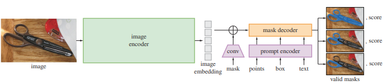
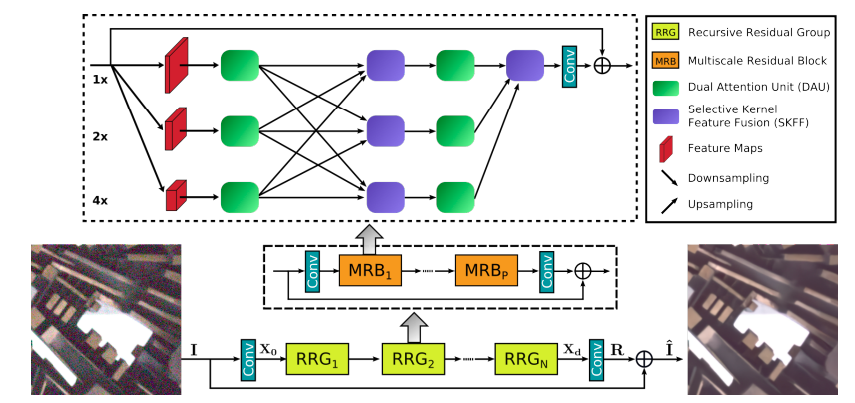
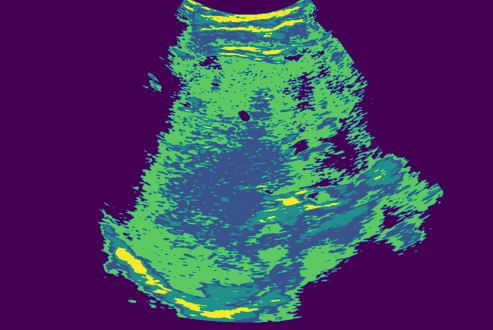
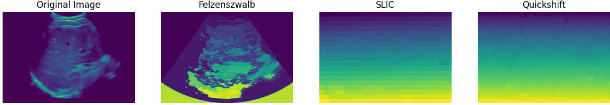
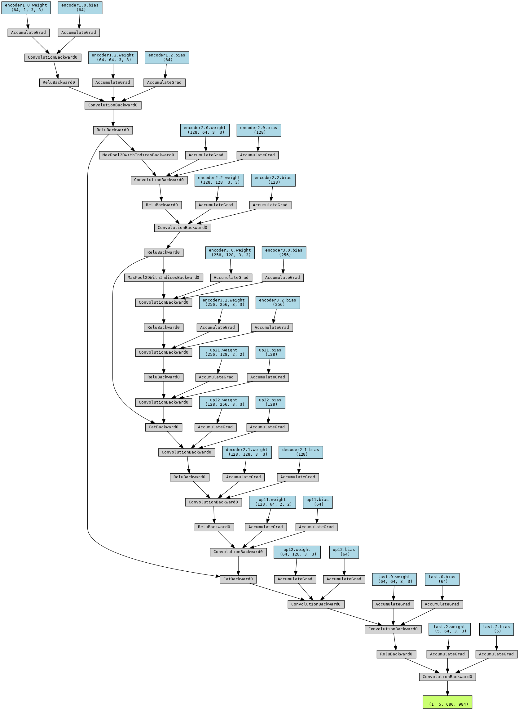
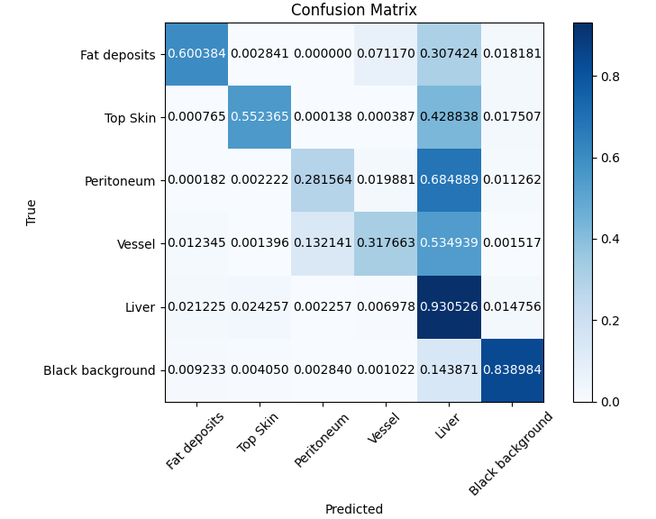
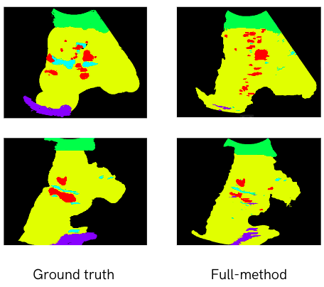
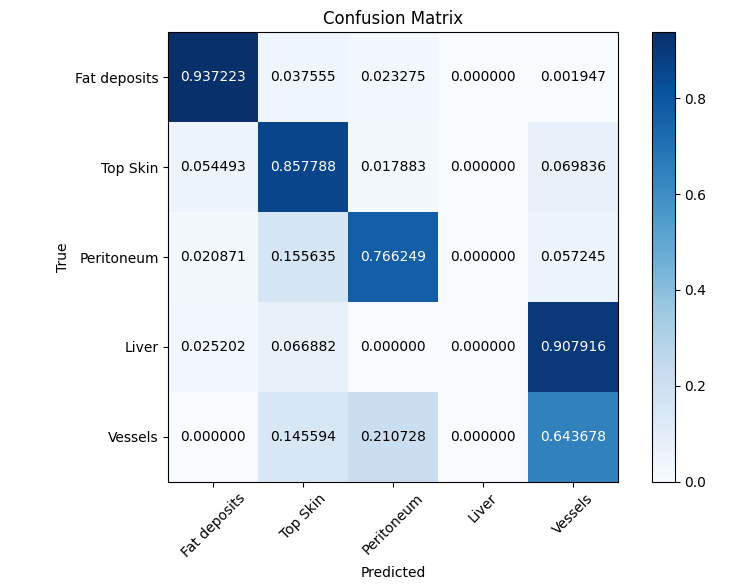

# Liver ultrasound Segmentation
[![PyPi][pypi-shield]][pypi-url]
[![Contributors][contributors-shield]][contributors-url]
[![License][license-shield]][license-url]
<!-- [![Build][build-shield]][build-url] -->
<!-- [![CodeCov][codecov-shield]][codecov-url] -->

<!-- MARKDOWN LINKS & IMAGES -->
<!-- https://www.markdownguide.org/basic-syntax/#reference-style-links -->

[pypi-shield]: https://img.shields.io/pypi/pyversions/zenml?style=for-the-badge

[pypi-url]: https://pypi.org/project/zenml/

[pypiversion-shield]: https://img.shields.io/pypi/v/zenml?style=for-the-badge

[downloads-shield]: https://img.shields.io/pypi/dm/zenml?style=for-the-badge

[downloads-url]: https://pypi.org/project/zenml/

[codecov-shield]: https://img.shields.io/codecov/c/gh/zenml-io/zenml?style=for-the-badge

[codecov-url]: https://codecov.io/gh/zenml-io/zenml

[contributors-shield]: https://img.shields.io/github/contributors/zenml-io/zenml?style=for-the-badge

[contributors-url]: https://github.com/AnasShahzad1996/liver_ultrasound_segmentation/graphs/contributors

[license-shield]: https://img.shields.io/github/license/zenml-io/zenml?style=for-the-badge

[license-url]: https://github.com/zenml-io/zenml/blob/main/LICENSE

[linkedin-shield]: https://img.shields.io/badge/-LinkedIn-black.svg?style=for-the-badge&logo=linkedin&colorB=555

[linkedin-url]: https://www.linkedin.com/company/zenml/

[twitter-shield]: https://img.shields.io/twitter/follow/zenml_io?style=for-the-badge

[twitter-url]: https://twitter.com/zenml_io

[slack-shield]: https://img.shields.io/badge/-Slack-black.svg?style=for-the-badge&logo=linkedin&colorB=555

[slack-url]: https://zenml.io/slack-invite

[build-shield]: https://img.shields.io/github/workflow/status/zenml-io/zenml/Build,%20Lint,%20Unit%20&%20Integration%20Test/develop?logo=github&style=for-the-badge

[build-url]: https://github.com/zenml-io/zenml/actions/workflows/ci.yml


<!-- PROJECT LOGO -->
<br />
<div align="center">
  <a href="https://www.cs.cit.tum.de/camp/start/">
    
  </a>

<h3 align="center">Ultrasound image segmentation</h3>

  <p align="center">
    This repository contains code to segment ultra-sound images using SOTA self-supervised methods
    <br />
    <a href="https://github.com/AnasShahzad1996/liver_ultrasound_segmentation/issues">Report Bug</a>
    ·
    <a href="#-meet-the-team">Meet the Team</a>
    <br />
    🎉 Version 0.1.0 is out. Release notes to be updated soon
    <a href="https://github.com/AnasShahzad1996/liver_ultrasound_segmentation/wiki">here</a>.
    <br />
    <br />
    <a href="https://www.linkedin.com/company/tum-camp/?originalSubdomain=de">
    
    </a>
  </p>
</div>


## Code execution

Follow these steps to set up and run the code in this repository:

1. **Clone the Repository**: First, clone this repository to your local machine using the following command:
```
git clone https://github.com/AnasShahzad1996/LiverUltrasoundSegmentation/tree/master
```
2. **Download the dataset**: Please download the ultrasound dataset on your machine. You would need to ask [Dr. Yordanka Velikova](https://www.linkedin.com/in/yordanka-velikova-366110a7/?originalSubdomain=de)
 to grant to access to the annotated dataset.

3. **Create conda repository**: make sure your system has conda installed
```
conda create -n liver_ultrasound python=3.7
conda activate liver_ultrasound
```

4. **Navigate to the Project Directory and build requirements**: 
```
cd LiverUltrasoundSegmentation
pip install -r requirements.txt
pip install matplotlib scikit-image opencv-python yacs joblib natsort h5py tqdm
```

5. **SAM-kmeans**: First execute the command by first denoising the images and then running them on SAM
```
python3 external_lib/MIRNet/demo.py /path/to/your/image_png 
python3 scripts/SAM_METHOD.py /path/to/your/image_png 
```

6. **Training and inference for UNET and segformer**
```
# training 
python3 src/UNET_train.py /path/to/train_directory /path/to/validation_directory
python3 src/segtransformer_train.py /path/to/your/input_directory

#inference
python3 src/unet_pred.py /path/to/your/test_directory
python3 src/segtrans_pred.py /path/to/your/test_directory
```

## SAM + k-means
SAM (Segment anything model) is a vision transformer (ViT) that includes an encoder and decoder. The model can accept various prompts from the user, such as a single point, a collection of points, or a bounding box. It's pre-trained on a large corpus, which equips it with the ability to perform zero-shot semantic segmentation. This means it can predict a valid mask even when the user's prompt is ambiguous. SAM consists of three components: an encoder, a decoder, and a flexible image encoder. The encoder is a MAE pre-trained vision transformer. The mask decoder efficiently maps the image embedding, prompt embeddings, and an output token to a valid mask. Additionally, the flexible image encoder maps the image embedding, prompt embedding, and an output token to a mask. SAM has been employed for unsupervised semantic segmentation in the medical domain. Future work may involve using variants of SAM, such as MedSAM, fine-tuned on medical images, to further improve the task.


*Figure 1: SAM Architecture*

For gathering input prompts for bounding boxes, two methods are utilized: k-means clustering and super-pixel resolution. K-means clustering is performed on image pixel intensities, while three super-pixel resolution methods are considered: Felzenszwalb's method, SLIC, and Quickshift. Due to the quality of prompts, super-pixel resolution is not extensively employed.


Furthermore, since SAM is a supervised model, we somehow have to gather input prompts for the bounding boxes. Hence, we choose two methods in order to compute the starting bounding box prompts: k-means clustering and super-pixel resolution. We perform k-means clustering on image pixel intensities. For super-pixel resolution, we use three methods :

    - item Felzenszwalb's method
    - item SLIC
    - item Quickshift

Due to the poor quality of prompts, we decided not to work with the super-pixel resolution entirely.

## Pre-processing
Since ultrasound images contain a lot of noise, we preprocess the images by denoising them by passing them through MIRNet. MIRNet is a residual network with spatial pyramidal pooling that allows low and high-level features to bypass the convolutional layers. We add Gaussian noise with std=10 to our images and then pass them through the network to denoise. We do not quite understand why first adding noise and then denoising leads to better performance. It might be that the nature of the noise in the ultrasound images is different from the Gaussian noise on which the MIRNet is trained. 


*Figure 2: MIRNet*

## Pipeline
After preprocessing, k-means clustering is performed on pixel intensities. K-means clustering is an iterative algorithm that updates randomly initiated clusters. Below are the equations that calculate the means clusters of each pixel:
Distance(xi, cj) = √(Σ(xik - cjk)^2)

Cluster(xi) = argminj Distance(xi, cj)



*Figure 3: Kmeans-clustering*
 
As you can see the k-means clustering output still has a lot of outliers, hence we predict the connected continuous labels by the CAA algorithm(connected component algorithm). The algorithm for region property analysis in image processing involves connected component analysis (CCA) to identify distinct regions in binary images. Each connected component is labelled, ensuring uniqueness. Various properties such as area, centroid, bounding box, and eccentricity are then computed for each labelled region. The algorithm iterates over all regions, extracting these attributes and storing them in a data structure. By thresholding over the area component, we are able to reduce many outliers. We then pass the components to the SAM model to refine the crude mask returned by the CAA algorithm.

We first segment the top skin layer followed by the detection of the lower peritoneum. The results for the prediction are listed below.

## Additional Experiments
As an alternative, we also explored and experimented with super-pixel resolution. We explored the Felzenswalb, slic and quick-shift methods respectively. However, as you can see we did not achieve noteworthy results in fig 6. For slic and quick-shift we lose all the spatial information about the image. However, the Felzenswalb method shows a bit of promise and we pass the super-pixels to SAM to refine clustering. However, since the super-pixels overlap and run along y-x direction, SAM is not able to discern which object we are precisely predicting. Which results in faulty detections for Felzenswalb method as well.


*Figure 4: Superpixel_res*


## Supervised Segmentation Models
In order to do a comparative study we train UNET and segtransformer on half of the dataset. We then perform inference of the other half of the dataset to if our models are able to learn relevant features that pertain to ultrasound images. 

UNET is a pyramidal pooling network that first downsamples an image to an embedding and then upsamples the embedding to the original image size. We use a kernel size of 3 and downsample the image to around 256 channels. 


*Figure 5: model_arch*

SegTransformer is an advanced neural network architecture designed for semantic segmentation tasks in the field of computer vision. Building upon the foundational concepts of the Transformer architecture, originally developed for natural language processing, SegTransformer adapts these principles for image analysis. It operates by dividing input images into non-overlapping patches, which are then embedded into lower-dimensional vectors. The model leverages multi-head self-attention mechanisms and feedforward networks within its Transformer blocks to capture spatial relationships and contextual information, essential for understanding image content. Positional encoding is employed to maintain spatial information during processing. By stacking multiple layers of these blocks, SegTransformer can extract multi-scale features, enabling it to learn hierarchical image representations, from low-level to high-level features. We use bilinear interpolation to first downsample the image to an acceptable size that the network can process. After that we upsample the prediction to compute the dice and IoU scores.

## Dataset

Our dataset is collected at IFL in Klinikum Rechts der Isar. The curvilinear probe is used to record ultrasound images. We have followed a certain structure to record the ultrasound scans. First, we started at the centre of the body and continued to the right side of the patient. We mainly focus on capturing transverse views to get more clear screenings of vessels. Our dataset contains liver ultrasound images of 15 patients. Our dataset is manually filtered by eliminating all-black and irrelevant images to get better results. We have annotated total of 412 images, approximately 30 frames per patient. We have 5 labels for the ultrasound images: 

- Blood vessels
- Subcutaneous skin layer
- Liver
- Fat deposits
- Peritoneum (layer enclosed the liver at the bottom)

## Models
### SAM + kmeans

The results for the SAM + kmeans-related methods are listed below, as you can see denoising the images before the prediction of the class leads to better performance. For super-pixel resolution, we use the Felzenswalb. However the model shows very poor performance across the board and does not detecting the top skin at all.

| Model                          | Dice  | mIoU  |
|--------------------------------|-------|-------|
| SAM-Kmeans                     | 0.71  | 0.58  |
| SAM-Kmeans (no denoising)      | 0.68  | 0.43  |
| SAM+superpixel resolution      | 0.38  | 0.17  |


In the figure below we can also see the vessel class is the most widely misclassified class in all of the labels. Vessels are frequently classified as white fat deposits while the liver is frequently misclassified as a peritoneum. However. the overall performance is pretty satisfactory considering the tendency of SAM to predict the top skin much further into into the liver. SAM also suffers from the problem of hallucinating pixels in the dark space around the liver, particularly when it is predicting a mask for a large area. Sometimes our model suffers from misclassifying shadows are blood vessels. 


*Figure 6: model_arch*


*Figure 7: sam_kmeans*

### Supervised learning methods
For our supervised learning models, we implemented the models in pytorch and trained them for 3 hours on an Nvidia 1080Ti GPU. We used a learning rate of 1e-5 with the Adam optimizer. We divided our dataset into 150:50:200 images for train, validation and testing. Finetuning the segformer model from hugging face resulted in the worse performance while UNET was slightly better than the SAM+kmeans method. This reveals that supervised learning methods require a large amount of data to efficiently learn the underlying distribution of the problem. In the future, we could work on few-shot segmentation methods that could utilize the data properly.

| Model      | Dice  | mIoU  |
|------------|-------|-------|
| Segformer  | 0.28  | 0.11  |
| UNET       | 0.77  | 0.65  |


*Figure 8: conf_unet*
